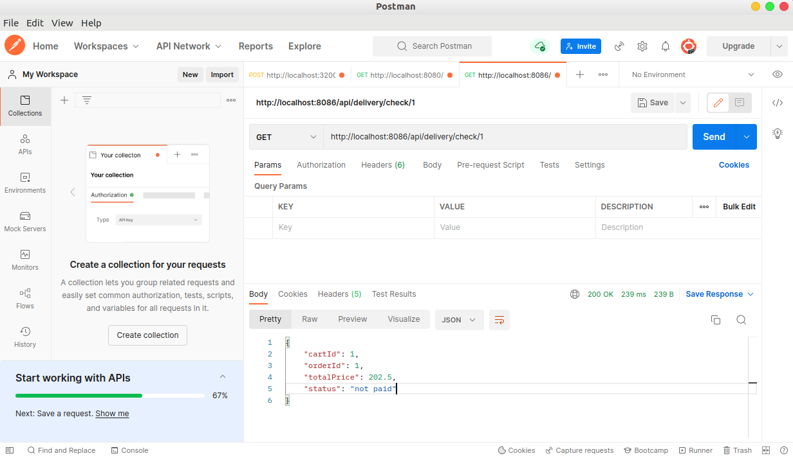

# aw08

Run the project with `mvn spring-boot:run` and send request to `http://localhost:8080/check`. You should see an reponses in json format like the following.

```json
{
  "icon_url": "https://assets.chucknorris.host/img/avatar/chuck-norris.png",
  "id": "kswv7NIaTCaIIErlBzODaA",
  "url": "https://api.chucknorris.io/jokes/kswv7NIaTCaIIErlBzODaA",
  "value": "Chuck Norris's shadow weighs 250 pounds and can kick your ass ."
}
```

Try to understand the provided code which demonstrates spring integration between a spring boot application with an externel http service (https://api.chucknorris.io/jokes/random).

Please implement delivery as an standalone service (just like the random joke service). Refer the sample code to integrate your Micropos system with delivery service so that user can check delivery status on Miropos which actually forwards user request to delivery service on demand.


Consider the advantage by doing so and write it down in your readme file.

---

+ 在aw05中，我们是怎么处理一个微服务对另一个的请求？我们需要手工借助一个类似`RestTemplate`，`HttpClient`，两者都有不少冗余代码要写，后者更是要在两个服务之间都进行配置，不是很方便。

+ 在aw07中，我们接触到了消息队列，最简单的逻辑实现是，当cart结算时会自动向消息队列中塞一条消息然后，delivery service会去消费他，这种逻辑减少了很多冗余代码，但是我们**依然要在两个服务之间简单配置**一下消息队列（也就是说还存在一定耦合），并且指定Consumer或者Function以进行处理。当然消息队列的好处不止于此。（详细的配置在aw07）

+ 在aw08，我们引入了`spring integration`

  ```java
  @Bean
    public IntegrationFlow inGate() {
        return IntegrationFlows.from(Http.inboundGateway("/api/delivery/check/{cartId}")
                        .requestMapping(m -> m.methods(HttpMethod.GET))
                        .payloadExpression("#pathVariables.cartId"))
                .headerFilter("accept-encoding", false)
                .channel("sampleChannel")
                .get();
    }
  @Bean
    public IntegrationFlow outGate() {
        return IntegrationFlows.from("sampleChannel")
                .handle(Http.outboundGateway(m -> "http://localhost:8085/api/delivery/check/" + m.getPayload())
                        .httpMethod(HttpMethod.GET)
                        .expectedResponseType(Order.class))
                .get();
    }
  ```

  上面是在cart微服务中添加的核心代码，可以看到，即使是在cart微服务中它也是比较独立的部分。同时在delivery微服务中不需要做任何配置。这样的好处也是很明显的。

    + 对于cart和delivery模块，他们实现更松的耦合，从而提高了各自的扩展性和可复用性。
    + 拥抱了函数式编程和响应式编程的新趋势。

+ 效果如下，我们依然利用cartId去查询订单状态，但是不直接发送给delivery service

  

